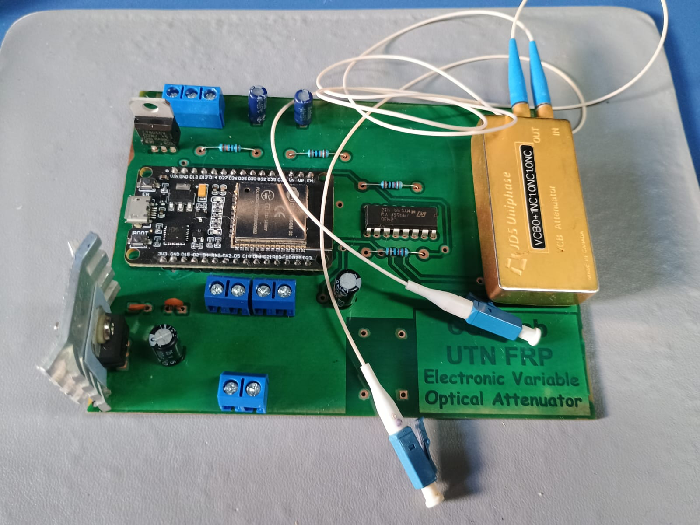
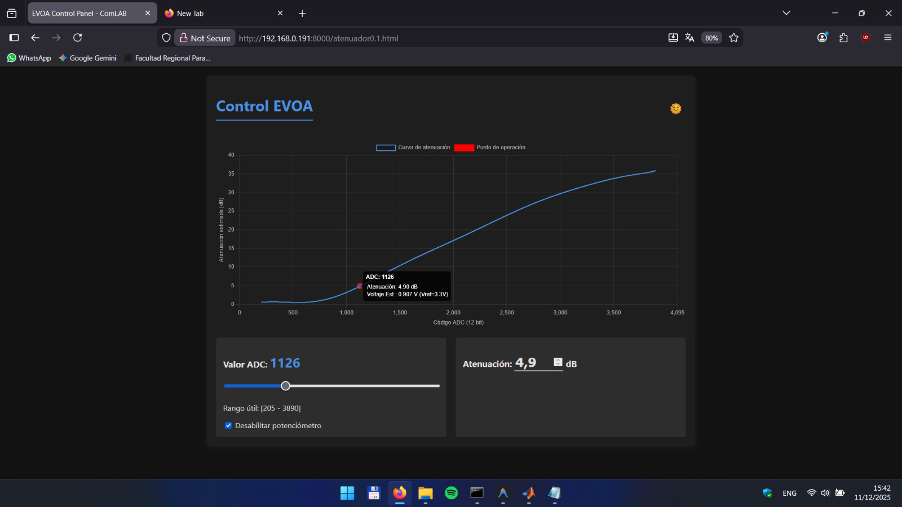

# EVOA-esp32-web: Electronic Variable Optical Attenuator (EVOA) with Web Control

This repository contains the development of an JDSU Voltage-Controlled Optical Attenuator controlled by an **ESP32-WROOM-32** microcontroller and accessed via a local Web Interface (WebServer).

The project is an improvement of the hardware design developed by [Karim Hacen](https://github.com/KarimHacen7/EVOAControlLoop).

---

## Final PCB

---

## Web Interface

To improve device monitoring and operation, the web interface includes real-time visualization of the attenuation/calibration curve and the control voltage applied to the optical attenuator.

The system also allows enabling or disabling an external potentiometer, providing both local manual control and remote web-based operation.

---
